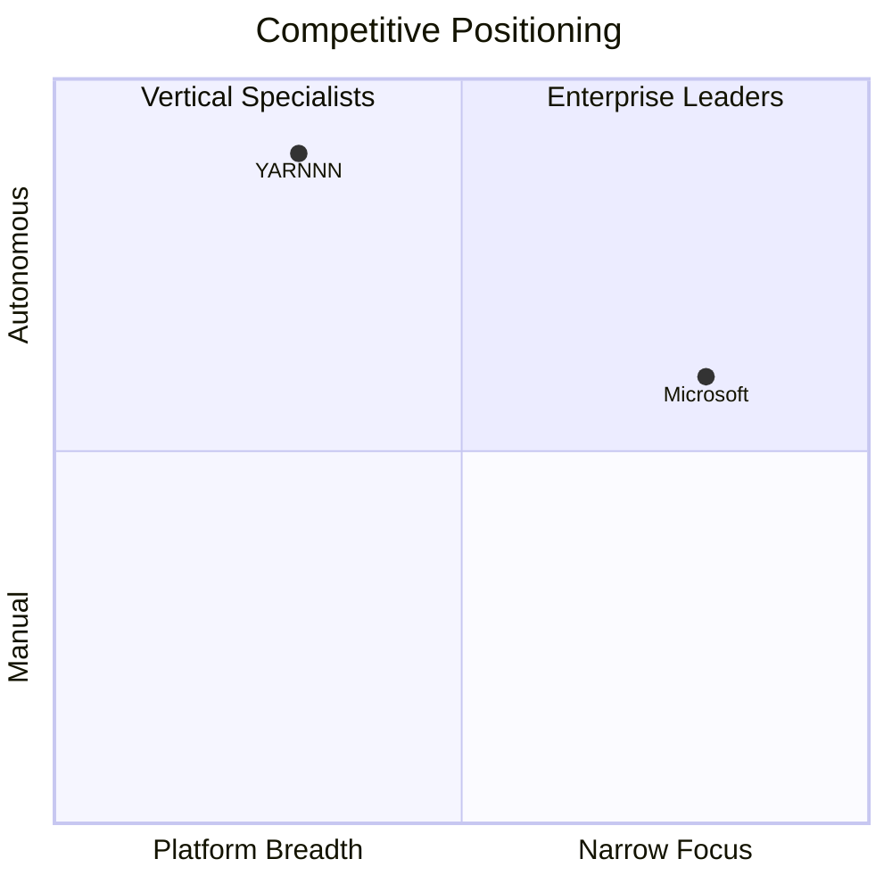

# ADR-148: Output Types & Production Phases

> **Status**: Proposed
> **Date**: 2026-03-29 (revised)
> **Authors**: KVK, Claude
> **Extends**: ADR-130 (HTML-Native Output Substrate), ADR-145 (Task Type Registry)
> **Supersedes**: The `output.md`-as-sole-artifact model + RuntimeDispatch-during-generation pattern
> **Analysis**: `docs/analysis/output-quality-first-principles-2026-03-29.md`

---

## Context

Three iterations of quality testing (2026-03-29) revealed that the output quality gap is not about agent count or process step architecture. It's about **what a finished deliverable is expected to contain** and **how visual assets get from the agent's reasoning to the final output**.

Current state:
- Agent produces markdown prose (400-700 words) with optional RuntimeDispatch tool calls for charts
- RuntimeDispatch competes for tool rounds with web search — agent typically chooses research over charts
- Chart specs require precise JSON construction during generation — error-prone, often fails silently
- No validation that assets were actually produced
- Compose service receives markdown with broken image references when charts failed
- Output looks like structured notes, not a finished deliverable

Expected state (reverse-engineered from a well-crafted published report):
- 1500-3000 words of **narrative prose** (paragraphs, not bullet points)
- 2-3 **rendered charts** interleaved with prose (visual every 2-3 paragraphs)
- 1-2 **rendered diagrams** (competitive positioning, market maps)
- Styled **comparison tables**
- All composed into professional HTML with proper visual rhythm

---

## Decision

### Three Concepts

**Output Type** — what a finished deliverable must contain. Defines the acceptance criteria: prose requirements, asset requirements, structural expectations. Declared per task type in the registry.

**Production Phases** — the sequence that produces a finished deliverable. Three phases, strictly separated:
1. **Generate** — LLM produces narrative prose with inline data (the cognitive work)
2. **Render** — mechanical extraction of asset specs from prose, rendered via render service (zero LLM cost)
3. **Compose** — mechanical assembly of prose + rendered assets into styled HTML (existing compose service)

**Delivery** — transport of the composed output to external destinations. Separate from output production.

### Output Type Registry

Each output type declares what "done" looks like:

```python
OUTPUT_TYPES = {
    "report": {
        "prose": {
            "min_words": 1500,
            "style": "narrative",  # flowing paragraphs, not bullet lists
            "instruction": "Write in flowing paragraphs. Use bullet points only for lists of items. "
                          "Every section should have 2-3 paragraphs of analysis, not just headers and bullets.",
        },
        "assets": {
            "charts": {
                "min": 2,
                "source": "data_tables",      # extract from markdown tables with numeric data
                "fallback": "mermaid_blocks",  # or from ```mermaid pie/bar blocks
                "instruction": "Include markdown tables with numeric data for key metrics. "
                              "These will be automatically rendered as charts.",
            },
            "diagrams": {
                "min": 1,
                "source": "mermaid_blocks",    # extract from ```mermaid code blocks
                "instruction": "Include mermaid diagrams for structural relationships "
                              "(competitive positioning, market maps, org charts).",
            },
        },
        "tables": {"min": 1},
        "sources": "required",
        "rhythm": "visual every 2-3 paragraphs",
    },

    "digest": {
        "prose": {
            "min_words": 500,
            "style": "structured",  # sections with attribution, scannable
            "instruction": "Use structured sections with clear headers. Attribution is mandatory.",
        },
        "assets": {
            "charts": {"min": 0},
            "diagrams": {"min": 0},
        },
        "tables": {"min": 0},
        "sources": "optional",
    },

    "brief": {
        "prose": {
            "min_words": 800,
            "style": "concise_narrative",  # paragraphs but concise
            "instruction": "Write concise paragraphs. Each section earns its place. "
                          "End with specific action items.",
        },
        "assets": {
            "charts": {"min": 0, "source": "data_tables"},
            "diagrams": {"min": 0, "source": "mermaid_blocks"},
        },
        "tables": {"min": 0},
        "sources": "optional",
    },

    "dashboard": {
        "prose": {
            "min_words": 800,
            "style": "data_first",  # metrics and tables dominate, prose interprets
            "instruction": "Lead with data. Use tables for metrics with period-over-period comparison. "
                          "Prose interprets the data — 1-2 sentences per metric, not paragraphs.",
        },
        "assets": {
            "charts": {
                "min": 2,
                "source": "data_tables",
                "instruction": "Include metric tables — these render as KPI cards and trend charts.",
            },
            "diagrams": {"min": 0},
        },
        "tables": {"min": 2},
        "sources": "optional",
    },

    "presentation": {
        "prose": {
            "min_words": 1000,
            "style": "slides",  # each ## is a slide, 3 bullets max
            "instruction": "Each ## heading is a slide. Slide titles are assertions, not topics. "
                          "3 bullets max per slide. Include a visual every other slide.",
        },
        "assets": {
            "charts": {"min": 1, "source": "data_tables"},
            "diagrams": {
                "min": 1,
                "source": "mermaid_blocks",
                "instruction": "Include at least one positioning or comparison diagram.",
            },
        },
        "tables": {"min": 1},
        "sources": "optional",
    },

    "article": {
        "prose": {
            "min_words": 1500,
            "style": "editorial",  # opinionated, voice-driven, long-form
            "instruction": "Write in the user's brand voice. Opinionated, not neutral. "
                          "Compelling hook, thesis, evidence sections, actionable conclusion. "
                          "Never start with 'In today's fast-paced world'.",
        },
        "assets": {
            "charts": {"min": 1, "source": "data_tables"},
            "diagrams": {"min": 0, "source": "mermaid_blocks"},
        },
        "tables": {"min": 0},
        "sources": "required",
    },
}
```

### Task Type → Output Type Mapping

```
competitive-intel-brief  → report
market-research-report   → report
industry-signal-monitor  → report
due-diligence-summary    → report
meeting-prep-brief       → brief
stakeholder-update       → dashboard
relationship-health-digest → brief
project-status-report    → brief
slack-recap              → digest
notion-sync-report       → digest
content-brief            → article
launch-material          → presentation
gtm-tracker              → dashboard
```

### Production Phases

#### Phase 1: Generate (LLM — the cognitive work)

The agent produces the full deliverable as markdown. It does NOT call RuntimeDispatch for charts. Instead, it produces **data inline** that post-processing can extract:

**Charts** — agent writes markdown tables with numeric data:
```markdown
The AI agent market saw significant funding concentration in enterprise:

| Category | Funding ($M) | Change vs Prior |
|----------|-------------|-----------------|
| Enterprise | 450 | +35% |
| Developer Tools | 280 | +12% |
| Vertical AI | 180 | +48% |

Enterprise platforms captured the majority of funding...
```

**Diagrams** — agent writes mermaid code blocks:
```markdown
The competitive landscape has consolidated into four quadrants:



As shown above, Microsoft dominates platform breadth while YARNNN...
```

The agent focuses entirely on **thinking, researching, and writing**. All tool rounds go to web search and context gathering. No tool rounds spent on asset rendering.

#### Phase 2: Render (Mechanical — zero LLM cost)

Post-generation, the pipeline:
1. Parses the output markdown for renderable content
2. **Tables with numeric data** → chart render via render service (type inferred: bar for comparisons, line for time series, pie for part-of-whole)
3. **Mermaid code blocks** → diagram render via render service (existing mermaid skill)
4. Rendered SVGs uploaded to Supabase Storage
5. Markdown updated: tables get a rendered chart inserted above/below them, mermaid blocks replaced with `` tags

This is a new function: `render_inline_assets(markdown, user_id) → (enriched_markdown, asset_urls)`.

#### Phase 3: Compose (Mechanical — existing compose service)

Takes enriched markdown (with rendered asset URLs) + layout_mode → styled HTML.

The compose service already handles this. The only change: it now receives markdown with `` tags for rendered charts/diagrams, not broken `` references.

### Asset Extraction Strategies

| Asset Source | Detection | Render Strategy | Chart Type Inference |
|---|---|---|---|
| Markdown table with numeric column | Regex: table rows with numbers | `POST /render` type=chart | 2 columns → bar; time-series header → line; <6 rows + % → pie |
| Mermaid code block | ` ```mermaid ` fence | `POST /render` type=mermaid | N/A (mermaid self-describes) |
| Inline chart spec (future) | `<!-- chart: type \| title \| data -->` | `POST /render` type=chart | Explicit in spec |

### Output Validation

After Phase 2, before Phase 3, the pipeline validates the output against the output type requirements:

```python
def validate_output(markdown: str, output_type: dict, rendered_assets: list) -> list[str]:
    """Returns list of warnings (not errors — output still proceeds)."""
    warnings = []
    word_count = len(markdown.split())
    if word_count < output_type["prose"]["min_words"]:
        warnings.append(f"Below minimum words: {word_count} < {output_type['prose']['min_words']}")
    if len(rendered_assets) < output_type["assets"]["charts"]["min"]:
        warnings.append(f"Below minimum charts: {len(rendered_assets)} < ...")
    # ... etc
    return warnings
```

Warnings are logged and stored in the manifest — they don't block delivery. Over time, warning patterns inform process instruction refinement.

### Delivery Separation

Delivery is a side effect of output production, not part of it:

- **Output** exists in workspace (`/tasks/{slug}/outputs/{date}/output.html`) whether or not delivery happens
- **Delivery** reads the composed output and transports it:
  - Email: sends output.html + optional PDF export
  - Slack: posts executive summary section (extracted from output) + link to full
  - Notion: writes structured page from output sections
- Delivery status is metadata on the output manifest, not a separate entity
- Delivery failure doesn't invalidate the output — the app always shows it

---

## Consequences

### What changes
- Output type registry added (`api/services/output_types.py`)
- Task type registry gains `output_type` field (mapping to output type key)
- Process instructions enriched with output type's prose/asset instructions
- RuntimeDispatch removed from generation loop (agents no longer call it directly)
- New `render_inline_assets()` function extracts and renders charts/diagrams post-generation
- Output validation step added between render and compose
- SKILL.md injection removed from system prompt (saves ~2000 tokens)

### What stays the same
- Agent type registry and capabilities
- Process step definitions (single-step or multi-step)
- Compose service API (`POST /compose`)
- Render service API (`POST /render` — called by post-processing, not by agents)
- Delivery service
- Frontend task page (reads output.html)
- Workspace storage model

### Key Simplification
- **Agents just write.** No RuntimeDispatch tool calls during generation. No JSON chart spec construction. No tool round competition between research and chart generation. The agent produces prose with inline data — the system handles rendering.
- **System prompt shrinks.** ~2000 tokens of SKILL.md documentation removed. More room for methodology + context + the actual output.

---

## Implementation Phases

### Phase 1: Output type registry + inline asset rendering
- Create output type registry with 6 types
- Add `output_type` field to task type registry
- Implement `render_inline_assets()` — table→chart and mermaid→SVG extraction
- Remove RuntimeDispatch from headless generation (keep for explicit TP chat usage)
- Remove SKILL.md injection from task execution system prompt
- Process instructions updated to include output type prose/asset guidance
- Validate with competitive-intel-brief: target 1500+ words, 2 rendered charts, 1 diagram

### Phase 2: Output validation + delivery separation
- Output validation function checks against output type requirements
- Warnings logged in manifest
- Delivery service reads composed output (no change to delivery flow)
- Slack delivery extracts executive summary for condensed post

### Phase 3: Adaptive multi-step
- Process definitions support both single-step and multi-step
- Runtime decision: agent has <5 runs → single-step; 5+ runs → multi-step (accumulated knowledge justifies handoff)
- Multi-step handoff quality validated with E2E tests

---

## Relationship to Existing ADRs

| ADR | Relationship |
|-----|-------------|
| ADR-130 (Output Substrate) | Extended — output types formalize the three-concern separation (capability/presentation/export) with explicit completeness criteria |
| ADR-145 (Task Type Registry) | Extended — task types gain `output_type` field |
| ADR-118 (Skills/Output Gateway) | Evolved — render service still produces charts/diagrams, but called by post-processing not by agents |
| ADR-141 (Execution Architecture) | Extended — render phase added between generation and composition |
| ADR-138 (Agents as Work Units) | Aligned — agents produce prose, system produces deliverables |

---

## Revision History

| Date | Change |
|------|--------|
| 2026-03-29 | v1 — Initial: artifact types, composition templates, multi-agent assembly |
| 2026-03-29 | v2 — Revised: output types as acceptance criteria, production phases (generate→render→compose), inline asset extraction replaces RuntimeDispatch-during-generation. Driven by three iterations of E2E testing showing the real bottleneck is asset rendering, not agent coordination. |
