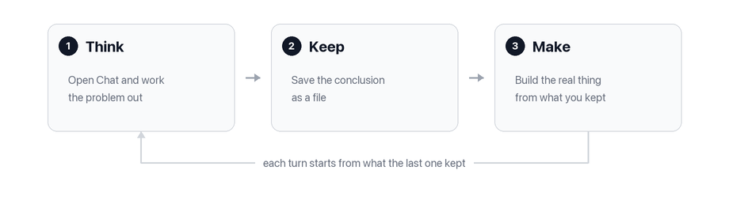

# How to Use YARNNN

Most AI tools forget. You explain your project, get something useful, and tomorrow you start over — re-explaining, re-correcting, re-pasting the same background.

YARNNN is a workspace where that work stays. You talk to AI here, and what comes out of the conversation becomes a **file** — one you can read, fix, build on, and share with the people you work with. Every AI you connect reads the same files.


**The one habit that matters:** when a conversation reaches a conclusion, save it as a file. Everything else in this page follows from that.


## The loop

Three steps, and you'll repeat them constantly.

| | | |
|---|---|---|
| **1. Think** | Open **Chat** and work the problem out | Pick any engine — Claude, GPT, Gemini, Grok, DeepSeek |
| **2. Keep** | Ask it to write the conclusion down | It becomes a file in your workspace, signed by you |
| **3. Make** | Open **Text**, **Slides**, **Blogger** or **Images** | Build the real thing, starting from what you kept |

A conversation you don't keep is gone in a week. A file you kept is something every future conversation can read, every document can be built from, and every teammate can see.

## What you'd actually use it for

### "I keep re-explaining my project to AI"

Put the background in once. Upload the documents you already work from — **Files → right-click → Add Files** — and write a file describing the project, the constraints, the decisions already made.

Now every conversation starts from it. When something changes, you fix the file rather than re-explaining in the next chat.

### "I want what I decide to survive"

Work the decision out in Chat, then:

> "Write that up as a decision note."

It lands as a file citing the conversation it came from. Six months later you can open it and see not just the decision but who made it and when.

### "I want to stop correcting the same mistake"

Fix the file, not the chat. A correction in a conversation lasts until that conversation ends; a correction to a file is permanent, and everything built from it afterwards starts from the corrected version.

This is the part you can only feel by doing it — around week two, you notice you've stopped re-explaining things.

### "My team and I are duplicating work"

Invite them: **Workspace Settings → Access**. Then the rule that makes it work:

- **Your chats stay private.** Nobody sees your conversations.
- **Your files are shared.** What you keep is visible to everyone.

So you can think messily without an audience and share the conclusion rather than the process. Every revision carries the name of whoever made it. See [Working with a team](../concepts/working-with-a-team.md).

### "I use ChatGPT and Claude for different things"

Connect both to the same workspace. Tell ChatGPT something worth keeping today; ask Claude about it tomorrow. See [the connector guide](../integrations/mcp-connector.md).

## Where your work lives

Everything lands in **Files** — an ordinary folder tree you can browse, with one difference: nothing is ever silently lost.

Right-click any file → **Properties** shows its full history: every version, who wrote it, and what changed. Delete is reversible. You can export the whole workspace whenever you like.

You don't have to think about this while working. It matters at exactly four moments:

- *"Why is this here?"* — the history tells you who wrote it and what changed
- *"Fix it once"* — correct the source, and everything made from it after inherits it
- *"Take it with you"* — reachable from any AI, and exportable
- *"Keep this"* — the moment a conversation becomes a file

## Your first week

If you want a concrete path from empty workspace to useful one:

1. **Upload what you already have.** The fastest way to make it useful is to stop it being empty.
2. **Work one real problem in Chat.** Not a test question — you can only tell whether grounding works on something you know the answer to.
3. **Keep the conclusion as a file.** The habit that makes the difference.
4. **Make something from it** in Text, Slides, Blogger or Images. The lane is faster at the first 60%; you're better at the last 40%.
5. **Correct a file** and notice what it does to everything built afterwards.
6. **Connect your other AI**, and use it from the other side.
7. **Bring in whoever you work with.**

| Habit | Why |
|---|---|
| Keep conversations as files | Thinking that doesn't land is thinking you'll redo |
| Fix files rather than re-prompting | A correction to a file is permanent; a correction in a chat is not |
| Upload rather than paste | Uploaded material is searchable by every conversation, forever |
| Check **Properties** when something surprises you | The history usually explains it |
| Set a budget early | So spend is a decision rather than a discovery — see [Usage](../plans/usage.md) |

## What not to expect yet

- **Scheduled pulling from connected platforms.** They can be authorised and scoped, but automatic pulling on a cadence isn't running yet.
- **Anything that acts on its own initiative.** Work happens in your conversation, or on a standing instruction you set up. There is no third mode.

---

Next: **[The apps](../concepts/the-desk.md)** — which app to open for what, and why there's more than one.
