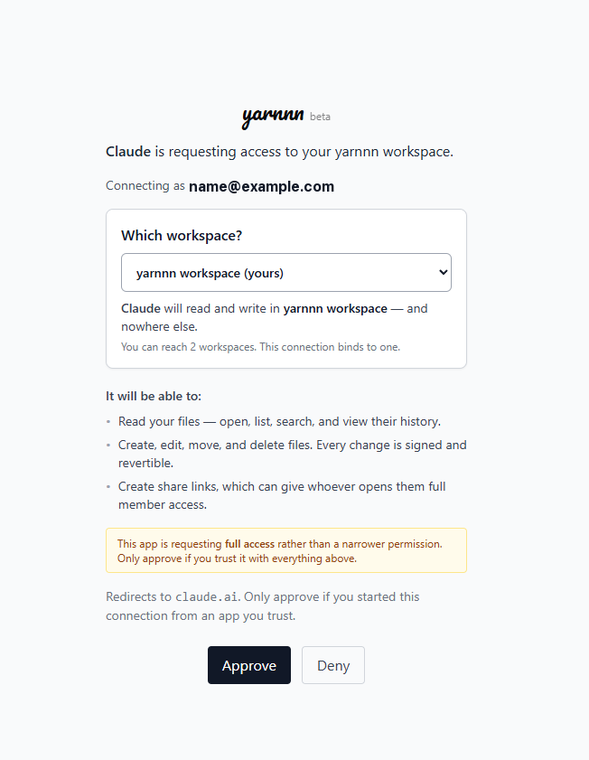

# Quickstart

Ten minutes to your first useful thing. No setup flow, no connections required.

## 1. Sign in

Go to [app.yarnnn.com](https://app.yarnnn.com). Your workspace exists as soon as you do — empty, and yours.

You'll land on a desk with eight apps in the Dock: **Chat · Text · Slides · Blogger · Images · Files · Agents · Reach**.

## 2. Think something through

Open **Chat** and start a lane. You pick the engine you want — Claude, GPT, Gemini, Grok or DeepSeek — and the conversation is grounded in your workspace. Your last pick is remembered, so this isn't a decision you re-make every time.

Ask a real question. Something you actually need an answer to today.

## 3. Keep what's worth keeping

When the conversation gets somewhere, get it out of the chat and into your workspace. Ask the lane to write it down:

> "Write that up as a decision note."

The file lands in your workspace, attributed to you, citing the conversation it came from. That's the moment the thinking stops being disposable.

## 4. Make something from it

Open **Text** for a document, or **Slides** for a deck. On the right there's a chat lane bound to what you're editing — point it at the note you just made:

> "Turn this into a five-slide deck."

Then take over. Drag blocks, change the layout, set the design. Words for exploring; hands for shaping.

## 5. Look at what happened

Open **Files**. Everything you just made is there.

Right-click any file → **Properties**. You'll see its full history: which revisions, who authored each one, and what changed. Click one to diff it against the current version.

That's `history`. It's the thing that makes the workspace an asset rather than an output folder.

## 6. Already working in Claude or ChatGPT? Connect from there


**This is the best way to use YARNNN.** If your thinking already happens in Claude or ChatGPT, don't move it. Connect YARNNN as a connector and your workspace becomes the memory those chats have always been missing — the same files, read and written from either side.


Add `https://mcp.yarnnn.com` as a connector:



**Settings** → **Connectors** → **Add custom connector** → name it `yarnnn`, URL `https://mcp.yarnnn.com`.



**Settings** → **Apps** → **Advanced settings** → **Developer mode** on, then **Create app** with MCP Server URL `https://mcp.yarnnn.com` and Authentication **OAuth**.



You'll be asked to approve the connection. This screen is YARNNN's, not the AI's:

You choose which workspace the connection binds to, and you see every permission before you approve it.

Three things worth reading on it:

- **Which workspace.** The connection binds to one. If you can reach more than one, the AI still only sees the one you pick here.
- **What it can do.** Read your files; create, edit, move and delete them; create share links. Every change it makes is signed as that AI and is revertible — you'll see its name in Files → Properties alongside your own.
- **Full access.** The connector asks for all of it, which is why the screen says so plainly. Approve it only if you trust that AI with everything listed.

Once it's connected, tell ChatGPT something worth keeping and ask Claude about it tomorrow. Same workspace, both directions.

Using **Claude Desktop** or **Claude Code** instead? Those need a config file — see the [full setup guide](../integrations/mcp-connector.md).

## What to do next

- Upload the documents you already have — Files → right-click → Add Files
- Meet the agents — who works with you, and in which app — [Agents](../apps/agents.md)
- Invite a teammate — [Working with a team](../concepts/working-with-a-team.md)
- Read [Your first week](your-first-week.md)
