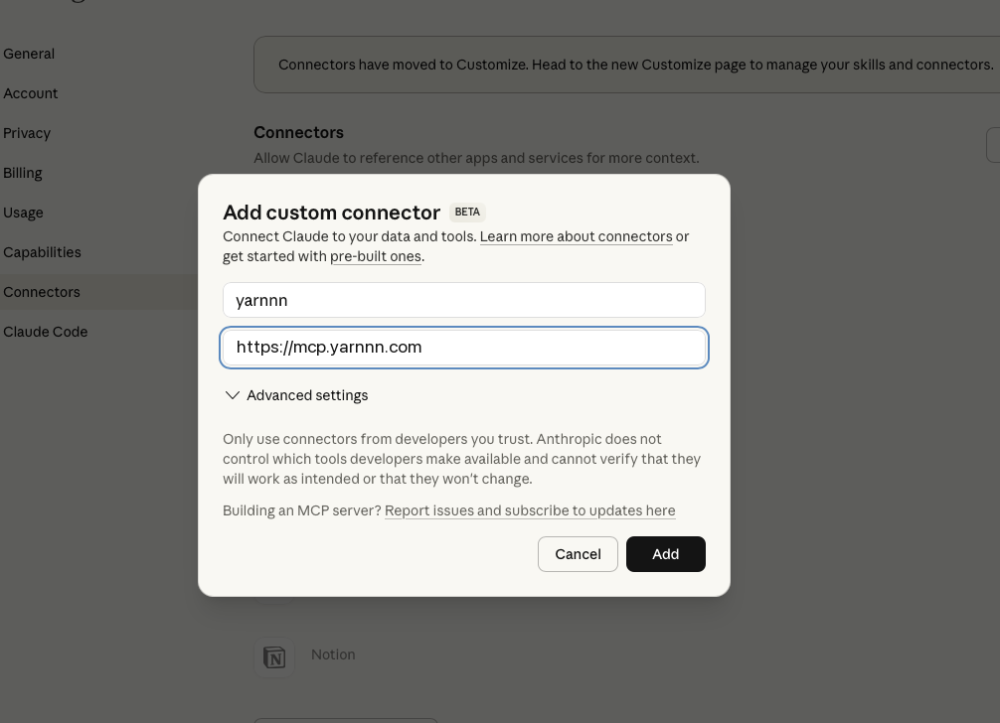
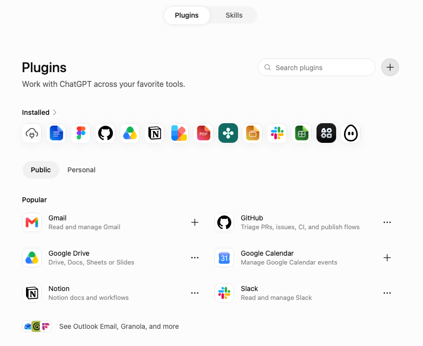
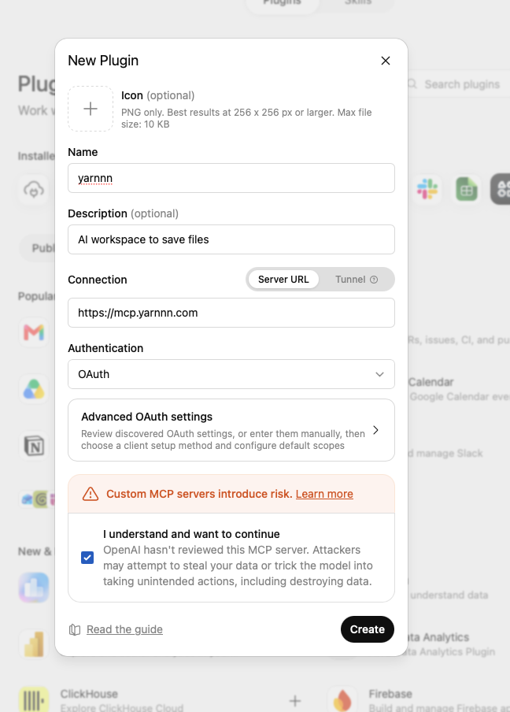

# MCP Connector — ChatGPT, Claude & More

You don't have to be in YARNNN to use YARNNN. Connect it to the AI you already work in, and that AI reads from and writes to the same workspace.

**Server URL:** `https://mcp.yarnnn.com` — the same everywhere. Works with **ChatGPT**, **Claude** (claude.ai, Desktop, Code) and any MCP-capable client. Included on every plan, including Free; an AI connection is never a billed seat.

## Set it up



1. **Settings** → **Connectors** → **Add custom connector**
2. Name: `yarnnn` · URL: `https://mcp.yarnnn.com`
3. **Add**, then complete the authorisation



Try: *"Use YARNNN to find what I have on the Q1 roadmap."*



ChatGPT connects MCP servers as **plugins**. Turn on Developer mode first: **Settings** → **Apps** → **Advanced settings** → **Developer mode**.

**1. Open the plugin directory** — **Settings** → **Plugins**, then the **+** at the top right.



**2. Fill in the New Plugin form**

| Field | Value |
|---|---|
| Name | `yarnnn` |
| Connection | leave on **Server URL** (not Tunnel) |
| Server URL | `https://mcp.yarnnn.com` |
| Authentication | **OAuth** |

Leave **Advanced OAuth settings** alone — YARNNN publishes its own metadata, so ChatGPT discovers the client setup and scopes itself.



**3. Tick the acknowledgment, then Create.** The risk warning appears for every custom MCP server, not just YARNNN. Complete the authorisation that follows.

Try: *"Use YARNNN to find what I have on the Q1 roadmap."*



Add to your config file:

**macOS** `~/Library/Application Support/Claude/claude_desktop_config.json`
**Windows** `%APPDATA%\Claude\claude_desktop_config.json`

```json
{
  "mcpServers": {
    "yarnnn": {
      "type": "streamable-http",
      "url": "https://mcp.yarnnn.com",
      "headers": {
        "Authorization": "Bearer YOUR_TOKEN"
      }
    }
  }
}
```

Replace `YOUR_TOKEN` with the bearer token from your YARNNN account settings, then restart Claude Desktop.



```bash
claude mcp add yarnnn \
  --transport http \
  --url https://mcp.yarnnn.com \
  --header "Authorization: Bearer YOUR_TOKEN"
```

Tools are available in your next session.



### Approving the connection

Claude.ai and ChatGPT both send you to YARNNN's own consent screen. Two things to read there:

- **Which workspace** the connection binds to. If you can reach more than one, it only ever sees the one you pick.
- **What it may do** — the tiers below. Every write is signed as that AI and is revertible.


Once it's connected, tell ChatGPT something worth keeping and ask Claude about it tomorrow. Same workspace, both directions.


---

## What a connection is allowed to do

A connection isn't all-or-nothing. Each verb sits in one of three tiers, and a client is granted only the tiers it asks for:

| Tier | What it allows |
|---|---|
| `files:read` | Read your files — open, list, search, view their history — and what your agents did (runs). |
| `files:write` | Create, edit, move, and delete files. Every change is signed and revertible. |
| `files:share` | Create share links, which can give whoever opens them full member access. |

The tiers are additive — write includes read, share includes both. A client that asks for nothing gets read-only, which is the safe floor.

This is enforced on every call, not just displayed at sign-up: a token holding `files:read` is refused when it tries to save. You see the tiers a connection asked for on the approval screen, and again at **Workspace Settings → Access**.


Connections made before tiers were introduced carry an older full-access grant, so they keep working. You can narrow or revoke any of them at any time.


## The verbs

File-native — the same files you see in YARNNN, not a separate memory store.

| Verb | What it does |
|---|---|
| `whoami` | Names where it's standing — which workspace, who its writes are signed as, and which verbs it holds. A good client calls this before writing somewhere you assumed. |
| `open` | Reads one exact file — content, who last changed it, and its recent revisions. |
| `list` | Shows what exists under a folder, with who last touched each. Also answers **what changed since a moment you name**, so a returning AI picks up where it left off. |
| `search` | Finds files by meaning. Returns the material plus a confidence signal. |
| `history` | How a file changed over time — who changed it, when, and what the change was. The one a plain storage connector can't do. |
| `runs` | What the workspace's agents did — a standing run, or an agent's steps in a member's own browser, each with where it happened. |
| `save` | Writes a whole file as an attributed revision. |
| `edit` | Changes part of a file — only the change travels, so a partial read can't destroy the rest. |
| `delete` / `move` | Remove or rename, with an attributed, restorable tombstone. |
| `request_upload` | Lands something that arrives as bytes rather than text — an image, a PDF, an export — as an attributed file. |
| `share` | Mints a member or read-only link for a file or the workspace, right from the conversation. |

Parameter-level detail is in the [MCP tool reference](../api-reference/mcp-tools.md).

Every write is attributed by name: you'll see `claude.ai` or `chatgpt` on the revision, and the connection appears as a revocable row in your members roster.

## Getting good results

- **Be explicit at first** — "use YARNNN to…" so the client reaches for the connector rather than guessing. Most pick it up on their own after a few uses.
- **Exact when you know the file, fuzzy when you don't.** `open` and `history` take a path or reference; `search` takes a topic; `list` shows what exists when you're sure of neither.
- **Confidence is a real signal.** When `search` comes back ambiguous, several things matched and none dominated — a good client asks which you meant rather than picking the first.
- **It's the same workspace.** Anything you save from ChatGPT is in Files when you next open YARNNN, and vice versa.

## Managing connections

Every connected AI appears at **Workspace Settings → Access** as a named row under **AI connections**, showing which provider it is and who connected it. From there you can **narrow** what region of the workspace it may write to, or **revoke** it — which ends the grant and deletes its tokens, so it would have to reconnect.

In a team workspace, each person's connections are their own. Revoking yours doesn't touch a teammate's.

## FAQ

**Does it cost extra?** No. MCP access is included on every plan, and an AI connection is never a seat.

**Can a connected AI change my whole workspace?** It writes what you ask it to. Its write access is a grant you can narrow or revoke at any time, and everything it writes is attributed to it — so you can always see what came from where.

**Do I need to keep YARNNN open?** No.
